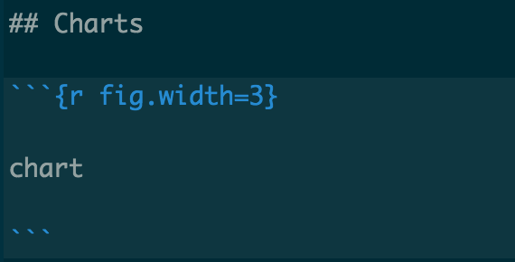
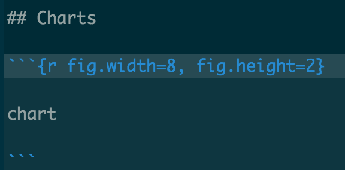
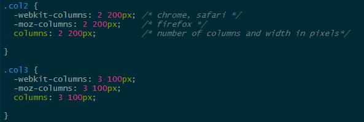

```{r setup, include=FALSE}
knitr::opts_chunk$set(echo = TRUE)
suppressPackageStartupMessages(library(tidyverse))
suppressPackageStartupMessages(library(scales))
suppressPackageStartupMessages(library(kableExtra))
suppressPackageStartupMessages(library(formattable))
```

## HTML Example

This is an example of an RMarkdown file that will render to HTML. 

While RMarkdwon will translate to HTML, you can incorporate code in the document as well.  `**Bolded Text**` and `<strong>Bolded Text</strong>` will both result in **Bolded Text**. 

## Lists

Here is an example of a list using RMarkdown. 

`* Item 1`  
`* Item 2`   
`* Item 3`  

renders as:

* Item 1
* Item 2
* Item 3

## Images

``

will insert this image:


You can also adjust the size of the image.  

`{width=250px}`  
{width=125px}

## R Code

```{r echo=TRUE}
suppressPackageStartupMessages(library(tidyverse))
suppressPackageStartupMessages(library(scales))


df <- read_csv("data/sample_data.csv")
```

### Some data cleaning

```{r echo=TRUE}
levels <- c ("1 - Not at All", 
             "2",
             "3", 
             "4", 
             "5 - Significantly")

df <- df %>% 
  mutate_at(vars (starts_with("session")),
            ~(parse_factor(., levels = levels)
                 )
            )

```


## Charts

```{r echo = TRUE}

chart <- df %>% 
  count (session_useful) %>% 
  mutate (perc = n / sum (n)) %>% 
  ggplot (aes (session_useful, perc)) +
  geom_col() +
  scale_y_continuous(labels = scales::percent_format(accuracy = 1),
                     limits = c(0,0.5)) +
  geom_text (aes (label = scales::percent(perc)),
             vjust = -1) +
  labs (x = "I found the session useful", 
        y = "Percent")
  
chart
```

{height=180px}

```{r echo=FALSE, fig.width=3}
chart
```

{height=180px}

```{r echo=FALSE, fig.width=8, fig.height=2}
chart
```


## Tables

### Regular R output
```{r echo=TRUE}
table <- df %>% 
  count (session_useful) %>% 
  rename (`I found the session useful` = session_useful) %>% 
  mutate (Percent = scales::percent (n / sum (n)) )

table
```

### Using the `kableExtra` package

```{r echo=TRUE}
table %>% 
  kable()
```

### Formatting with `kableExtra`
#### http://haozhu233.github.io/kableExtra/awesome_table_in_html.html

Changing the font size
```{r echo=TRUE}
table %>% 
  kable() %>% 
  kable_styling(position = "center", font_size = 15)
```

Adjusting column widths
```{r echo=TRUE, results='asis'}
table %>%
  kable(align = c ("lcc")) %>% 
  kable_styling(font_size = 15) %>% 
  column_spec(2:3, width = "8em")
```

Formatting cells
```{r echo=TRUE}
table %>%
  mutate (Percent = cell_spec (Percent, 
                               background = "#FA19C3"),
          n = ifelse (n > 40, 
                      cell_spec (n, color = "green"),
                      cell_spec (n, color = "red"))) %>% 
  kable(escape = FALSE, 
        align = c ("lcc")) %>% 
  kable_styling(font_size = 15) %>% 
  column_spec(2:3, width = "8em")
```


## Split Columns - HTML
### This requires HTML embedded with RMarkdown

In CSS file add the following:



In the RMarkdown file add the following:  

`<div class="col2">`

Add content here    

`</div>`  


